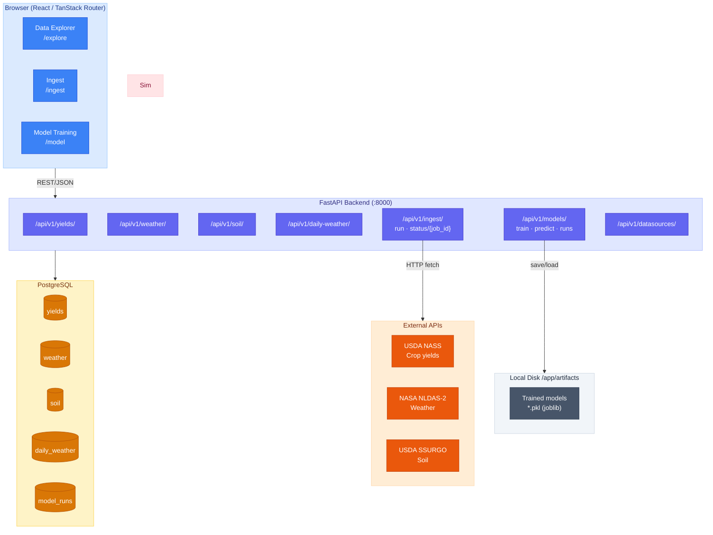
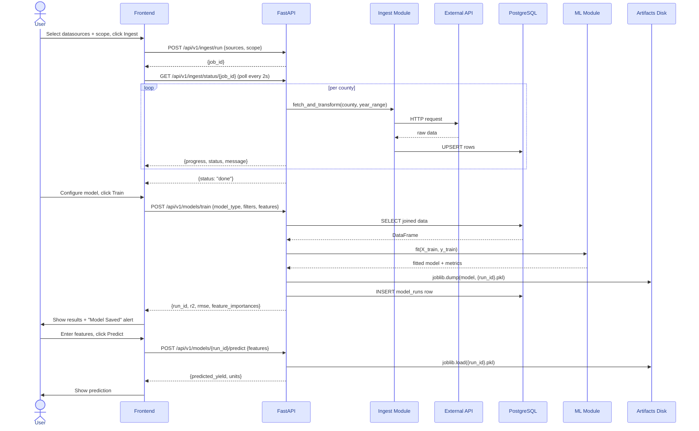
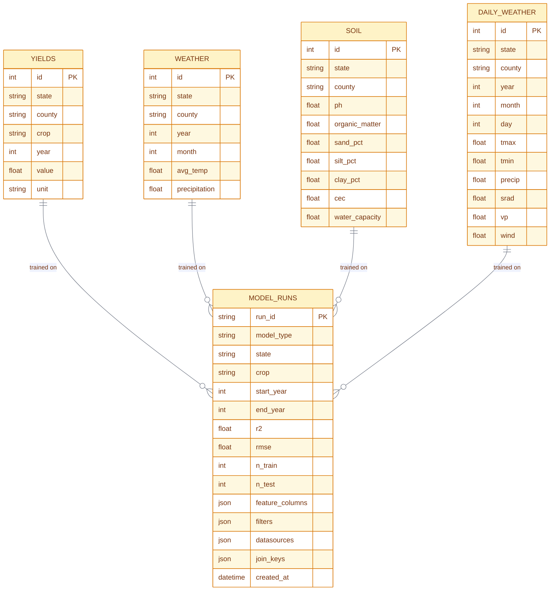
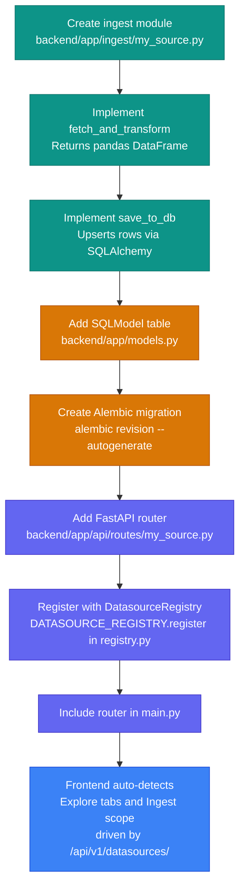
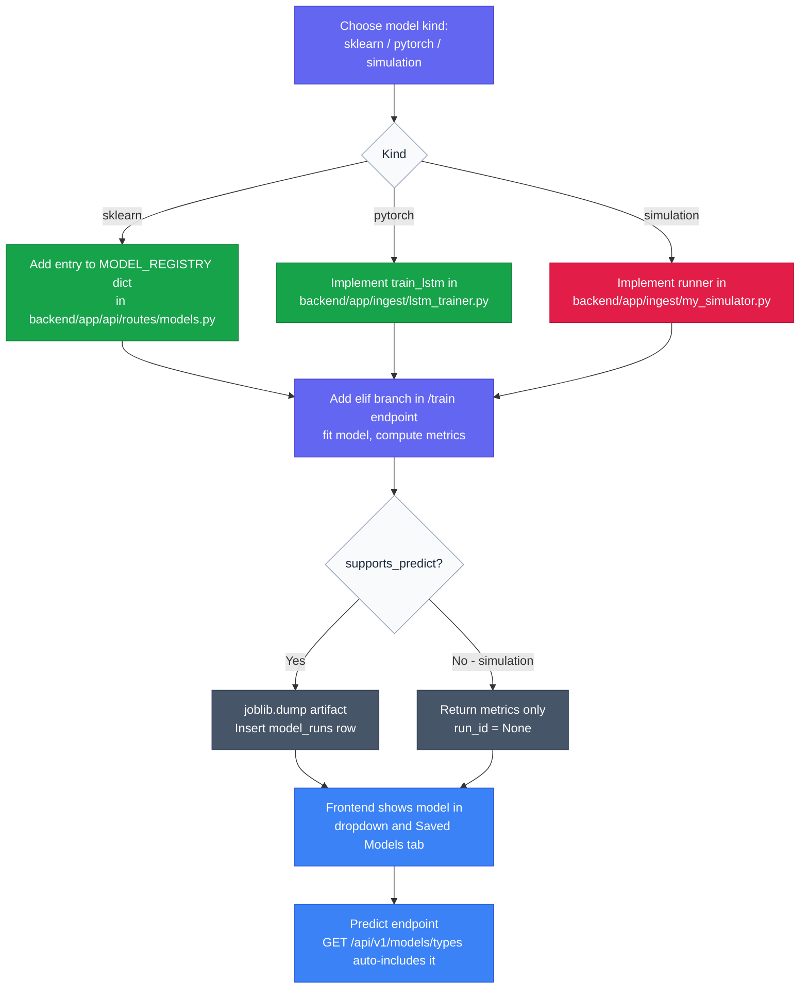
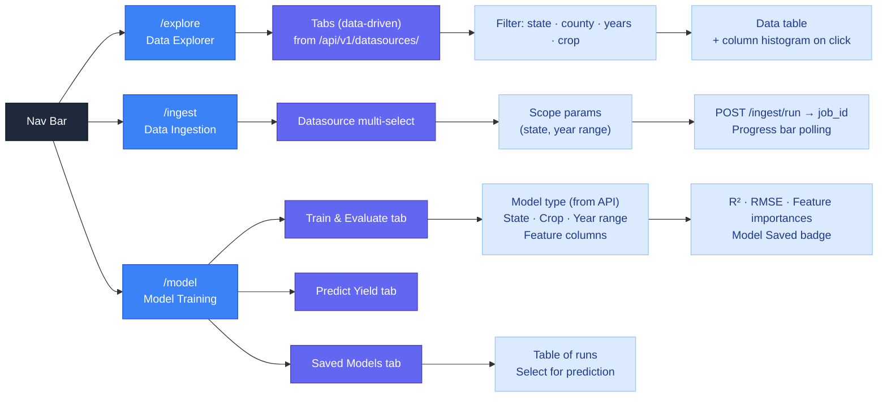
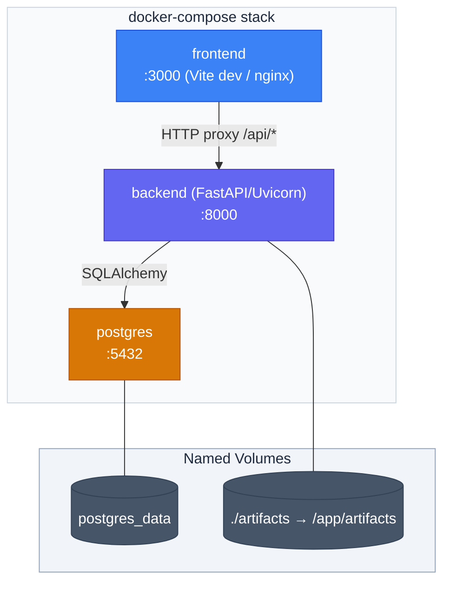

# MLPlayground — Architecture & Design Diagrams

> All diagrams use [Mermaid](https://mermaid.js.org/). Render them in any Mermaid-compatible viewer (GitHub, VS Code extension, mermaid.live).

---

## 1. System Architecture

High-level view of all components and how they communicate.

---

## 2. Data Flow — Ingestion → Training → Prediction

End-to-end lifecycle of data.

---

## 3. Database Schema

---

## 4. Datasource Registry — Adding a New Data Source

Step-by-step process to register a new datasource so it appears automatically in the Explorer and Ingest pages.

### Registry Entry Fields

| Field | Purpose |
|-------|---------|
| `key` | Unique identifier (e.g. `"yields"`) |
| `label` | Human-readable name shown in tabs |
| `endpoint` | API path for fetching data (e.g. `"/api/v1/yields/"`) |
| `columns` | Column definitions `{name, type}` shown in Explorer table headers |
| `scope_params` | Filter inputs rendered in Ingest UI (state, year range, etc.) |
| `description` | Tooltip text shown in Explorer tab |

---

## 5. Model Registry — Adding a New Model Type

---

## 6. Frontend Page Map

---

## 7. Deployment (Docker Compose)

