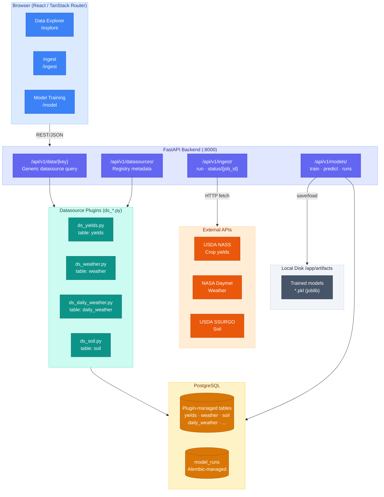
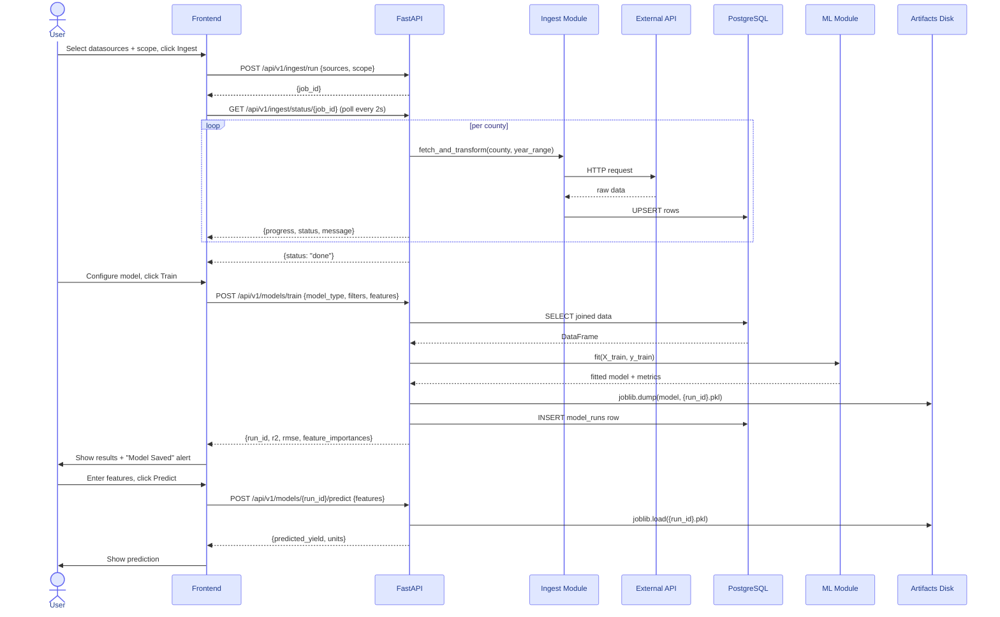
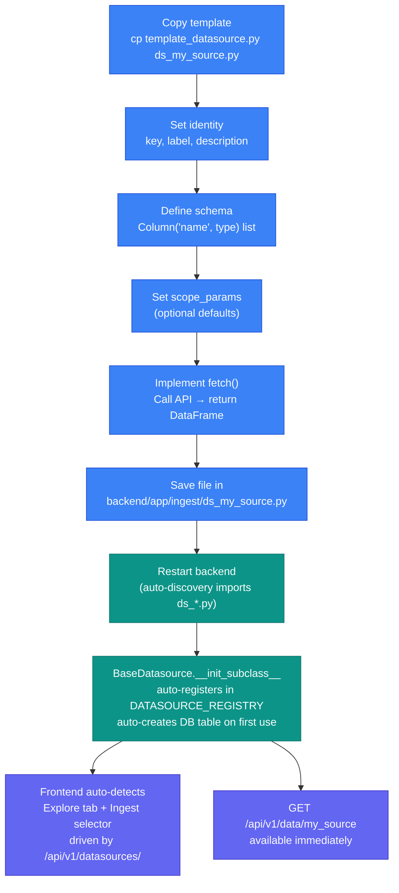
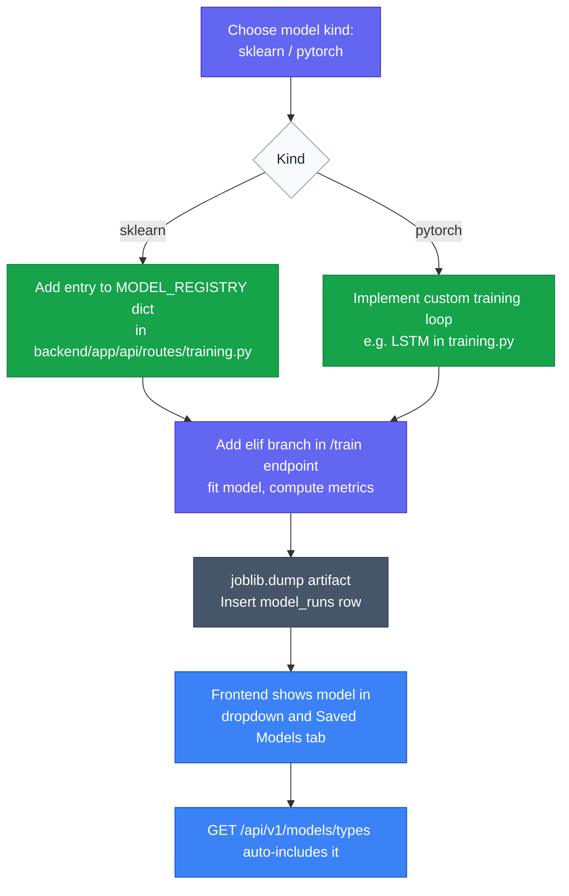
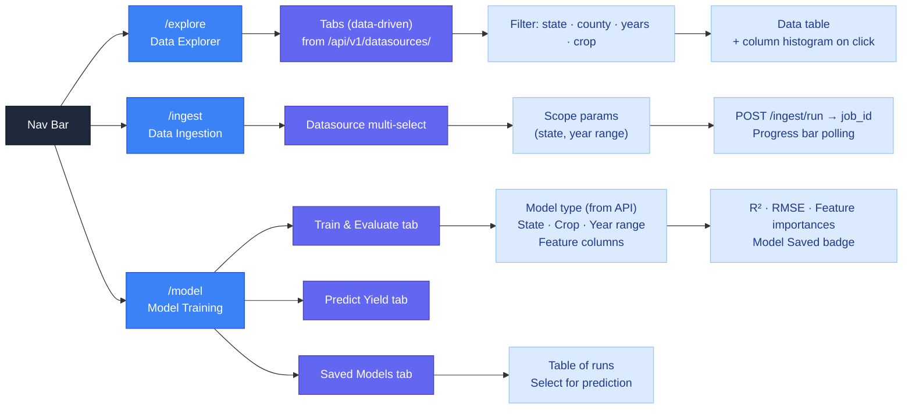
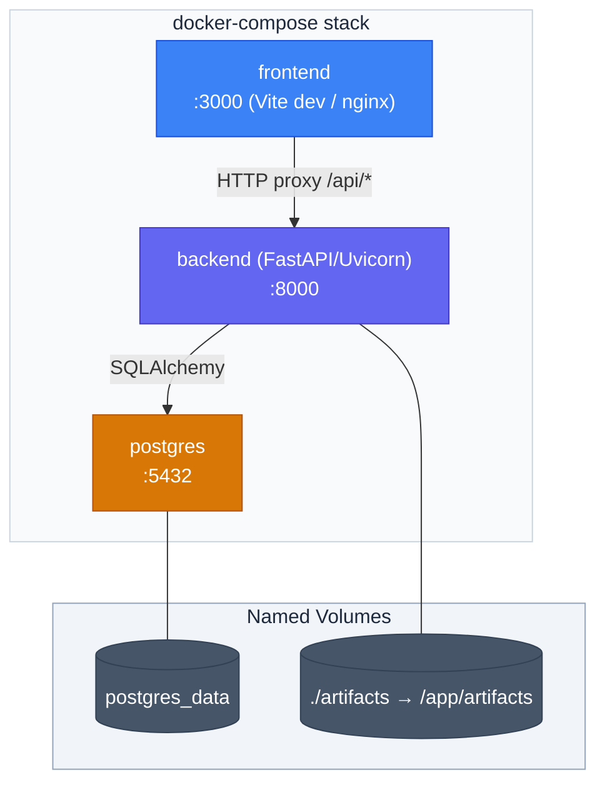

# MLPlayground — Architecture & Design Diagrams

> All diagrams use [Mermaid](https://mermaid.js.org/). Render them in any Mermaid-compatible viewer (GitHub, VS Code extension, mermaid.live).

---

## 1. System Architecture

High-level view of all components and how they communicate.



---

## 2. Data Flow — Ingestion → Training → Prediction

End-to-end lifecycle of data.



---

## 3. Database Schema

`model_runs` is the only Alembic-managed table. All datasource tables (yields, weather, etc.) are **plugin-managed** — created lazily by `BaseDatasource._get_table()` on first use. They do not appear in `db_models.py` and have no Alembic migrations.

```mermaid
%%{init: {'theme': 'base', 'themeVariables': {'primaryColor': '#fef3c7', 'primaryBorderColor': '#d97706', 'primaryTextColor': '#78350f', 'lineColor': '#6b7280', 'attributeBackgroundColorEven': '#fffbeb', 'attributeBackgroundColorOdd': '#fef9c3'}}}%%
erDiagram
    MODEL_RUNS {
        string  run_id      PK
        string  model_type
        string  state
        string  crop
        int     start_year
        int     end_year
        float   r2
        float   rmse
        int     n_train
        int     n_test
        json    feature_columns
        json    filters
        json    datasources
        json    join_keys
        datetime created_at
    }

    PLUGIN_TABLES["Plugin-Managed Tables\n(schema from ds_*.py columns)"] {
        string  key
        string  columns     "Defined by BaseDatasource subclass"
        string  table_name  "e.g. yields, weather, soil, daily_weather"
        string  created_by  "BaseDatasource._get_table() on first upsert"
    }
```

---

## 4. Datasource Plugin System — Adding a New Data Source

All datasource functionality — table creation, API endpoint, Explore tab, Ingest selector — is handled by creating a single `ds_*.py` file.



### Registry Entry Fields (set on the `BaseDatasource` subclass)

| Field | Purpose |
|-------|---------|
| `key` | Unique identifier (e.g. `"yields"`) — also the URL slug (`/api/v1/data/yields`) |
| `label` | Human-readable name shown in Explore tabs and Ingest selector |
| `description` | Tooltip text shown in the Explorer tab |
| `columns` | `Column("name", type)` list — defines the DB table schema and Explorer headers |
| `scope_params` | Filter inputs rendered in Ingest UI (state, year range, etc.) |
| `endpoint` | **Auto-set** to `/api/v1/data/<key>` — never set manually |

---

## 5. Model Registry — Adding a New Model Type



---

## 6. Frontend Page Map



---

## 7. Deployment (Docker Compose)


